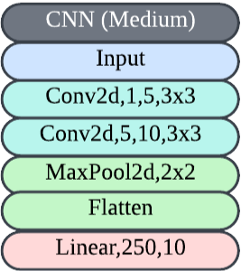
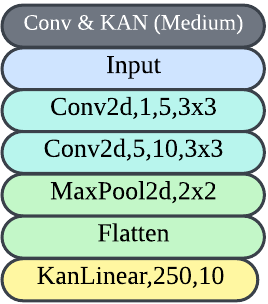
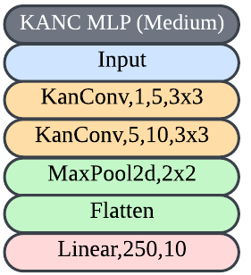
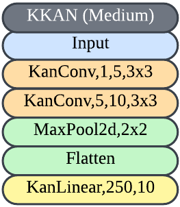

# 🧠 Convolutional-KANs-C
**C++ version of Convolutional KANs**

## 📚 Table of Contents
- [Introduction](#introduction)
- [Architectures](#architectures)
- [Installation](#installation)
- [Usage](#usage)
- [Testing](#testing)
- [License](#license)


## 🧑‍💻 Introduction

- Developed Convolutional Kolmogorov-Arnold Networks (KAN) in C++ using LibTorch, converting the original Python implementation in PyTorch for compatibility with embedded systems.
- Optimized the model for deployment on resource-constrained devices, focusing on efficient memory usage, real-time processing, and maintaining high accuracy.
- The C++ version is tailored for embedded systems and high-performance environments, providing scalable solutions for neural network tasks.

For reference, the original Python implementation is available here: [Convolutional-KANs Python Version](https://github.com/AntonioTepsich/Convolutional-KANs)

## 🏗️ Architectures
### 🌀 Convolution


### 🔀 Conv and KAN


### 🔄 KANconv and MLP


### 🧩 KANconv and KAN


## ⚙️ Installation
To build the project, you need to have CMake and a C++ compiler installed on your system. Follow the steps below to build the project:

1. Clone the repository:
   ```sh
   git clone https://github.com/yourusername/Convolutional-KANs-C.git
   cd Convolutional-KANs-C
   ```

2. Create a build directory and navigate to it:
   ```sh
   mkdir build
   cd build
   ```

3. Run CMake to configure the project:
   ```sh
   cmake ..
   ```

4. Build the project:
   ```sh
   make
   ```

## 🏃‍♂️ Usage
To run the main application, execute the following command from the build directory:

```sh
./CKan
```

## 🧪 Testing
Unit tests are located in the `test` directory. To run the tests, use the following command from the build directory:

```sh
make test
```

## 📜 License
This project is licensed under the MIT License. See the LICENSE file for more details.